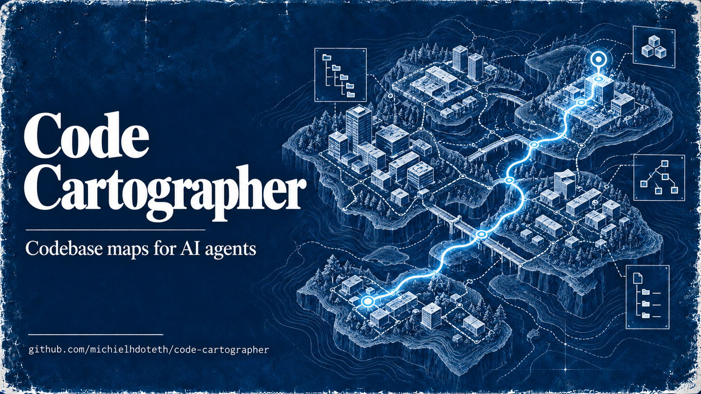

# Code Cartographer

<p align="center">
  
</p>

**Codebase maps for AI agents.** Code Cartographer scans a repository and gives developers and agents practical ways to find code, understand relationships, inspect changes, and assemble useful context without reading the whole project first.

Use the Go CLI to map a codebase, list symbols, search source, estimate change impact, or build token-budgeted context for a file. The Web UI provides interactive views of repository structure and dependencies.

## Quick start

### Build the CLI

Requires Go 1.25 or newer.

```bash
mkdir -p bin
cd cmd
go build -o ../bin/carto .
cd ..
```

On Windows, use PowerShell:

```powershell
New-Item -ItemType Directory -Force .\bin | Out-Null
Push-Location .\cmd
go build -o ..\bin\carto.exe .
Pop-Location
```

Map and inspect a project:

```bash
./bin/carto map ./my-project
./bin/carto stats ./my-project
./bin/carto analyze all ./my-project
./bin/carto find "functionName" ./my-project
```

The map records the Git commit, branch, and timestamp. Cartographer stores local manifests and indexes under `.carto/` in the target project.

### Build and run the Web UI

Requires Bun.

```bash
bun install
bun run build
./bin/carto serve
```

The `serve` command serves the generated `./build` directory from the current working directory.

## CLI commands

| Command | What it does |
| --- | --- |
| `carto map <path>` | Scan a codebase and record its Git revision |
| `carto analyze [type] [path]` | Analyze dead code, complexity, circular dependencies, or health |
| `carto find <pattern> [path]` | Search source files for text or a regular expression |
| `carto symbols <path>` | List functions, classes, types, and other symbols |
| `carto stats [path]` | Summarize files, imports, symbols, and languages |
| `carto context <file>` | Assemble file context with estimated token use |
| `carto index [path]` | Build a local full-text index at `.carto/search-index.json` |
| `carto diff [path]` | Show changes since the last map |
| `carto changed [path]` | List uncommitted additions, edits, and deletions |
| `carto impact <file>` | Trace the dependency blast radius of a file |
| `carto info` | Show CLI information and examples |
| `carto serve` | Start the interactive Web UI |

Examples:

```bash
carto map ./my-project --lang go,typescript
carto analyze dead-code ./my-project --json
carto symbols ./my-project --type function
carto context ./my-project/src/main.go --tokens 8000 --imports --callers --json
carto index ./my-project
carto diff ./my-project
carto changed ./my-project
```

`carto impact <file>` resolves the file from the current working directory. Run it from the root of the project you want to inspect:

```bash
cd ./my-project
carto impact cmd/main.go
```

Use `carto --help` or `carto <command> --help` to see all options. The global `--json` flag returns machine-readable output where supported.

## Code analysis

Code Cartographer supports 22 languages through Tree-sitter parsers and built-in fallback parsing. It extracts declarations, imports, and function calls to build code relationships and metrics.

| Analysis | What it looks for |
| --- | --- |
| Dead code | Unused exports and orphaned files, with confidence and repository-history signals |
| Duplicate blocks | Repeated normalized function bodies across files |
| Complexity | Functions with high cyclomatic complexity |
| Circular dependencies | Import cycles between files or modules |
| Health | A combined view of detected issues and code metrics |
| Blast radius | Direct and transitive dependents, hubs, and concentrated file risk |

## Agent context and search

`carto context` gathers a target file and can add its imports or callers. It reports estimated token usage and truncation status, so an agent can request relevant surrounding code with a chosen budget:

```bash
carto context ./src/handler.go --tokens 8000 --imports --callers --json
```

`carto symbols` lists declarations by file or directory. `carto find` searches source text, with optional regular-expression and case-sensitive modes. `carto index` builds a reusable local term index for source files.

## Commit-aware repository context

Cartographer associates a map with the Git revision where it was created. Use `diff` to see committed changes since that map and `changed` to inspect the current working tree. Use `impact` to follow dependencies before changing a file.

This helps answer questions such as “what changed?”, “where is this symbol defined?”, and “which files may be affected by this edit?”

## Interactive Web UI

The Web UI helps people explore repository structure with a file explorer, language distribution, health and architecture panels, Git diff views, dependency hubs, and graph layouts including tree, treemap, matrix, radial, and flow.

## Technology

- **CLI:** Go, Cobra, and Tree-sitter
- **Web UI:** React, TypeScript, Vite, Tailwind CSS, D3.js, and WebGL
- **Package manager:** Bun

## Development

Build and test the Go CLI:

```bash
cd cmd
go test ./...
go build ./...
```

Run the Web UI checks and build:

```bash
bun install
bun run test
bun run type-check
bun run build
```

## License

MIT
